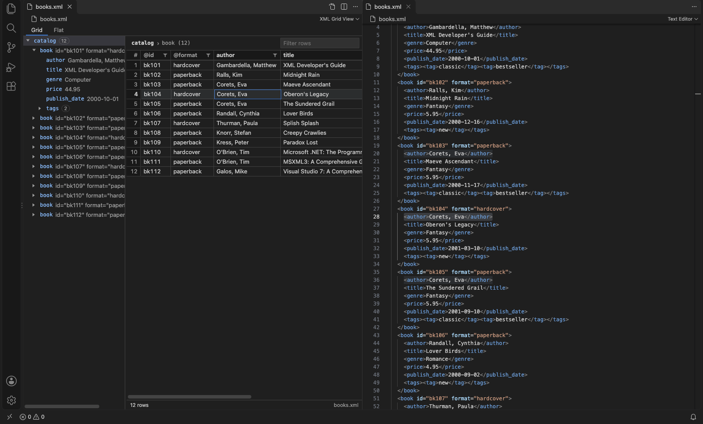
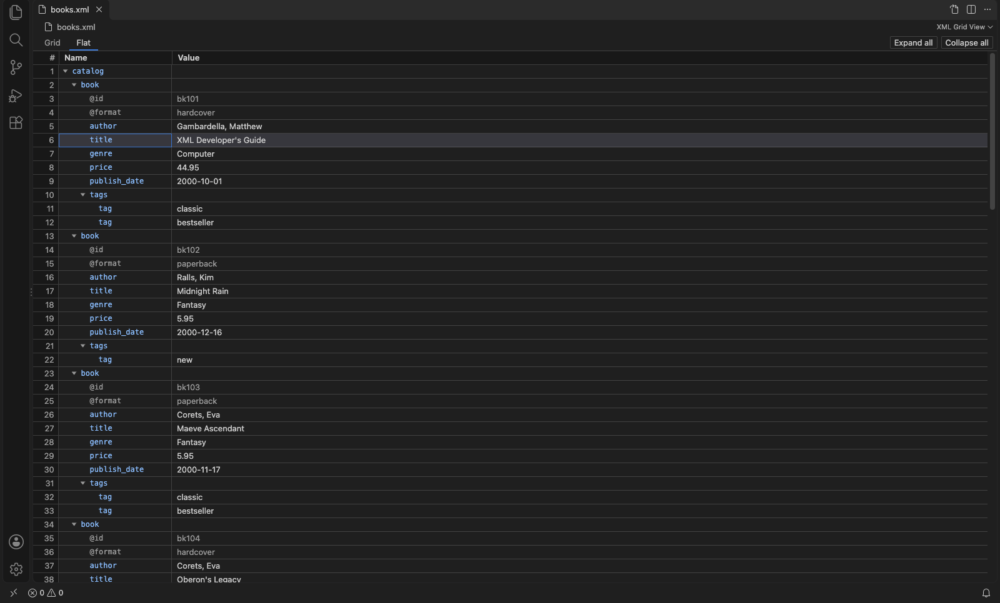
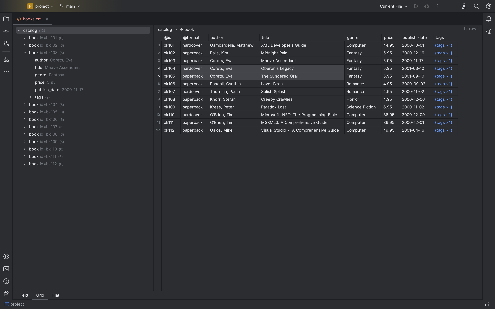
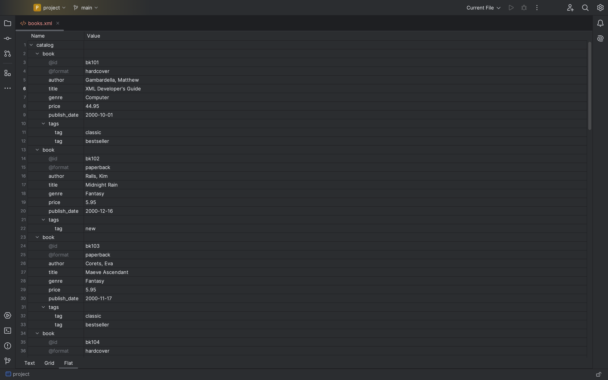
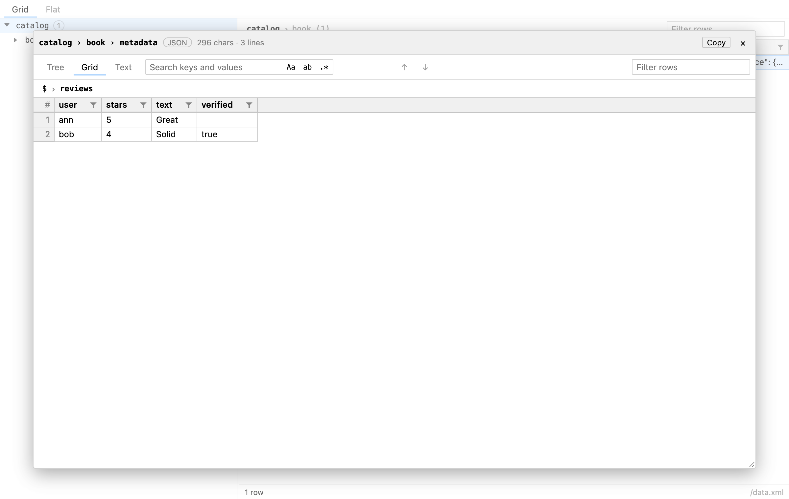
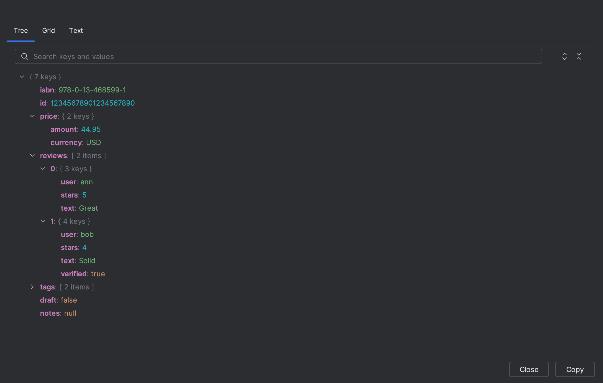

# XML Grid View

| VS Code: Grid, with source beside | VS Code: Flat |
| --- | --- |
|  |  |
| **IntelliJ: Grid tab** | **IntelliJ: Flat tab** |
|  |  |
| **Value inspector: JSON as a grid** | **Value inspector: JSON tree (IntelliJ)** |
|  |  |

A read-only XML viewer for VS Code and IntelliJ. It shows the document as a
tree on the left and a grid on the right, with search and XPath. It never
modifies the document.

| Package | What it is |
| --- | --- |
| `packages/core` | TypeScript model with no DOM or UI dependencies. Includes the saxes parser with source offsets, the grid builder, the search engine, XPath, and the host↔view message protocol. This is the reference implementation for the golden fixtures. |
| `packages/webview` | Preact UI. All parsing, model building, search and XPath run in a Web Worker. esbuild bundles it to `webview.js` and `webview.css`. |
| `packages/vscode` | VS Code extension: a `CustomTextEditorProvider` that hosts the web view. |
| `packages/intellij` | IntelliJ plugin with a native Swing UI. It has its own Java model built from XML PSI, and the Gradle build doesn't need Node. |
| `fixtures/` | Shared golden test cases. Vitest and JUnit both assert against them; see [`fixtures/SCHEMA.md`](fixtures/SCHEMA.md). |

## Building

Requirements: Node 22+ and pnpm 10 (`corepack enable`). The IntelliJ plugin
also needs any JDK able to run Gradle; Gradle provisions Java 21 automatically.

```sh
pnpm install
pnpm build            # core → webview → packages/vscode/xml-grid-view-<version>.vsix
pnpm test             # vitest: core unit tests + golden fixtures
pnpm lint             # eslint + typecheck for all TS packages

cd packages/intellij
./gradlew buildPlugin # → build/distributions/xml-grid-view-intellij-<version>.zip
./gradlew test        # JUnit: golden fixtures + model + light UI tests
```

The VS Code smoke test runs with `pnpm --filter xml-grid-view test` and
downloads VS Code on first use.

## Installing

Prebuilt `.vsix` and IntelliJ plugin `.zip` files are attached to each
[GitHub release](https://github.com/bdarwin/xml-grid-view/releases). To build them
yourself, see above. Releases are made by pushing a `v*` tag; the release
workflow runs the tests and then attaches both builds.

### VS Code

Choose **Extensions → … → Install from VSIX…** and pick
`packages/vscode/xml-grid-view-<version>.vsix`. From a terminal, run
`code --install-extension packages/vscode/xml-grid-view-0.1.0.vsix`.

XML files still open in the text editor. To open the viewer, use **Open With
XML Grid View**, from the editor title button, the Explorer context menu or
the Command Palette.

### IntelliJ (2024.3 or newer)

Choose **Settings → Plugins → ⚙ → Install Plugin from Disk…** and pick the zip
from `packages/intellij/build/distributions/`. XML files still open in the text
editor, and a **Text | Grid** tab bar appears at the bottom of the editor. Click
**Grid** to open the viewer. To see source and grid side by side, use the
editor tab's **Split Right**.

## Features

The two hosts work the same way; small differences are listed under Known
limitations.

- **Tree:** keyboard navigation. Enter or F4 moves the text editor's caret to
  the element, centers it and focuses the editor.
- **Grid:**
  - Rows are the selected element's children with one tag. When there are
    several tags, a combo box switches between them.
  - Columns are the attributes (`@id`), text-only child elements, and `#text`
    for mixed content.
  - Repeated or complex children appear as `{tag ×n}` cells that drill down,
    and a breadcrumb leads back up.
  - Sorting is numeric when every value is a number.
  - A quick filter (web view) and per-column filters (text plus a checklist of
    up to 1,000 distinct values, all ANDed together).
  - Auto-fit column widths, row numbers, multi-cell selection, and copy as TSV
    with an optional header.
- **Flat view:** the whole document as an outline sheet with Name and Value
  columns.
  - One row per element in document order, indented by depth. Attributes
    appear as `@name` rows under their element.
  - Rows collapse and expand. Copy gives indented TSV that pastes cleanly into
    Excel, and Enter/F4 jumps to the source.
  - In VS Code, use the **Grid | Flat** switch at the top of the view. In
    IntelliJ, use the **Flat** bottom tab (**Text | Grid | Flat**).
- **Value inspector:** for long text or JSON stored inside a node.
  - Open it with **Shift+Enter** on any cell, Flat value or tree node, or with
    the **⤢** button that appears on long values.
  - Text shows in full, with wrapping and search.
  - JSON is detected automatically and gets three tabs:
    - Tree: collapsible, with search.
    - Grid: the same drill-down grid as XML, with sort and filters.
    - Text: pretty-printed.
  - Big numbers are shown exactly as written.
- **Find (Ctrl/Cmd+F):**
  - Match case, whole word and regex.
  - Scope: the current grid or the whole document.
  - Targets: element names, attribute names, attribute values and text.
  - Matches are highlighted in cells and tree nodes, with an "n of m" counter.
    Enter/Shift+Enter and F3/Shift+F3 step through them.
  - A results list for document-wide searches, and an option to show only
    matching nodes in the tree.
- **XPath mode:**
  - Every namespace prefix declared in the document is bound automatically.
    The default namespace is bound to `d:`, because XPath 1.0 can't match it
    without a prefix.
  - Errors appear inline, and scalar results are shown directly.
- **Live updates:** the view follows edits made in the text editor (debounced
  300 ms). Tree expansion, selection, tag group, sort and filters are kept
  wherever their paths still exist.
- **Malformed XML:** the view keeps the last valid model and shows a warning
  banner with the error location. Click it to jump there.
- **Large files:** files over 50 MB need an explicit **Load anyway**. In VS
  Code the limit is the `xmlGridView.largeFileThresholdMB` setting.
- **Theming:** VS Code maps its `--vscode-*` theme variables onto the view's
  `--xgv-*` CSS variables. IntelliJ uses JBColor/JBUI throughout.

## Releasing

See [PUBLISHING.md](PUBLISHING.md). Pushing a `v*` tag runs the full test suite,
then creates a GitHub release and publishes to the VS Code Marketplace, Open VSX and
JetBrains Marketplace. Each marketplace is published only once its token secret is set.

## License

[MIT](LICENSE) © Darwin Baisa

## Golden fixtures

`fixtures/cases/*.xml` hold the shared test cases. For each case, the expected
tree, grids, search hits and XPath results are generated from the TypeScript
core:

```sh
pnpm fixtures:generate   # rewrite expected files — then review `git diff fixtures/`
pnpm fixtures:check      # what CI runs: fails if anything is stale, never writes
```

To add a case:

1. Drop `<name>.xml` into `fixtures/cases/`. Use LF line endings.
2. Optionally write `<name>.search.json` with queries and `"expected": null`.
3. Run the generator and review the output by hand.

CI never accepts regenerated output on its own.

## Known limitations

- **Read-only by design:** there is no editing in the grid.
- **Grid model:**
  - Only elements without attributes and without element children count as
    text-only columns. Elements with attributes, such as
    `<price cur="USD">1</price>`, appear as `{price ×1}` drill-down cells.
  - Mixed-content text is joined and trimmed but not collapsed, so
    `Hello <b>x</b> world` shows `#text` as `Hello  world`.
- **XPath:**
  - XPath 1.0 only.
  - The web view uses a pure-JS engine (`xpath` + `@xmldom/xmldom`), because
    browsers don't expose `DOMParser` or `document.evaluate` inside Web
    Workers. The core also has a native `DOMParser` backend for UI-thread use.
  - XPath needs a well-formed document.
- **Malformed input:** saxes (web view) and the JDK parser (IntelliJ) recover
  from errors differently. Partial trees can differ, and error columns can
  differ. Fixtures compare only the line.
- **Comments, processing instructions and DTDs:** they aren't shown. Custom
  DTD entities aren't expanded.
- **Line endings:** IntelliJ normalizes line endings to LF, so a CRLF file
  reports different offsets in each host. Navigation is correct in both.
- **Large files:** the web view holds the whole tree skeleton in memory. Files
  of a few hundred MB may exhaust the webview's memory even after **Load
  anyway**.
- **IntelliJ differences:**
  - The column filter opens from the header's right-click or context menu,
    not from a header button.
  - *Copy with Header* is a context-menu item, not a setting.
  - A find hit inside a leaf child selects its row, not the specific cell.
  - The Swing UI is covered by headless light tests but hasn't been tried by
    hand in `runIde`.
- **VS Code:** the view reloads when its tab is hidden
  (`retainContextWhenHidden` is off to save memory). UI state is restored from
  saved view state.
